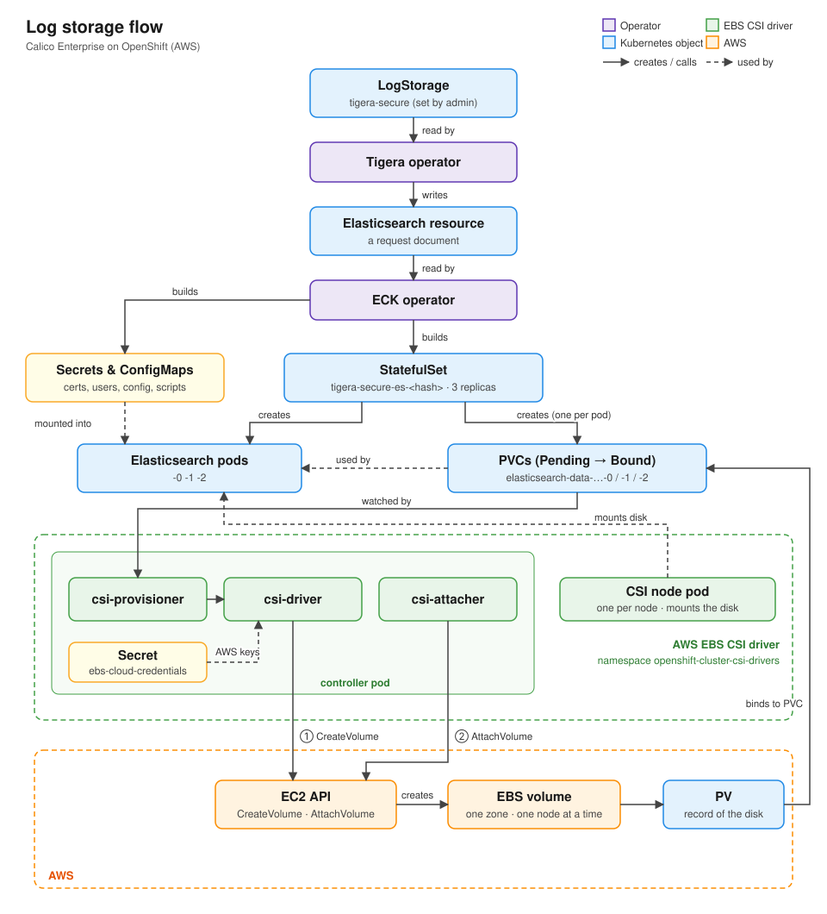
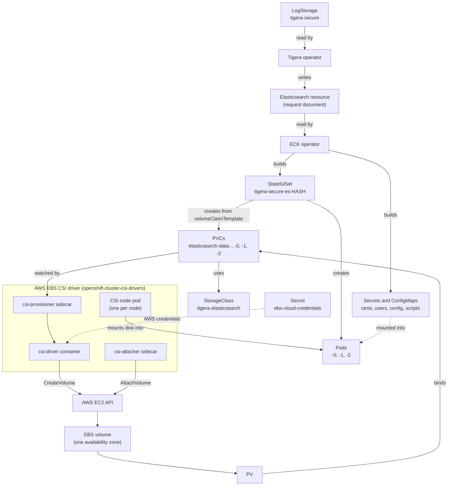
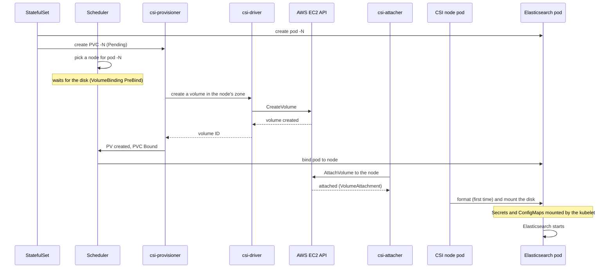

# Calico Enterprise Log Storage on OpenShift (AWS): How It Works

A step-by-step guide to how Calico Enterprise's Elasticsearch gets its storage on OpenShift running on AWS: which operators are involved, what owns what, and where to look when it breaks.

---

## 1. The big picture



Text version:

```
LogStorage "tigera-secure"            <- you configure this
        │  read by
        ▼
Tigera operator
        │  writes
        ▼
Elasticsearch custom resource         <- a "request document"
        │  read by
        ▼
ECK operator (Elastic Cloud on Kubernetes)
        │  builds
        ▼
StatefulSet tigera-secure-es-<hash>   +  Secrets and ConfigMaps (certs, users, config, scripts)
        │  creates                            │  mounted into the pods
        ├──► Pods  tigera-secure-es-<hash>-0, -1, -2
        └──► PVCs  elasticsearch-data-tigera-secure-es-<hash>-0, -1, -2
                    │  StorageClass: tigera-elasticsearch
                    ▼
AWS EBS CSI driver (managed by OpenShift)
        │  calls
        ▼
AWS EC2 API  ->  EBS volume  ->  PV  ->  PVC Bound  ->  Pod starts
```

### Component diagram



### Sequence: what happens when a new PVC is created



---

## 2. The building blocks

| Term | What it is |
|---|---|
| **LogStorage** | Tigera resource that describes the log storage you want (node count, storage size, StorageClass). There is one per cluster, and it **must be named `tigera-secure`**; the operator ignores any other name. |
| **Elasticsearch resource** | A custom resource (`kind: Elasticsearch`) written by the Tigera operator. It is a *request* ("I want a 3-node cluster with 1000Gi disks"), not a running thing. |
| **ECK operator** | Elastic's operator, shipped by Tigera. It reads the Elasticsearch resource and builds the real objects (StatefulSet, Services, Secrets, config). |
| **StatefulSet** | A controller object that keeps a set of *numbered* pods running. It is not a pod; it creates pods. |
| **Pod** | The running Elasticsearch process. It mounts a PVC. |
| **PVC (PersistentVolumeClaim)** | A *request* for storage ("I need 1000Gi of type X"). It is not a pod and runs nothing. |
| **PV (PersistentVolume)** | Kubernetes' record of an actual disk that satisfies a PVC. |
| **StorageClass** | Says *how* to create disks for PVCs: which provisioner (`ebs.csi.aws.com`), disk type, and when to create them. |
| **EBS volume** | The real disk in AWS. |
| **AWS EBS CSI driver** | OpenShift component that turns PVCs into EBS volumes and attaches them to nodes. |
| **Secret** | Stores sensitive data (certificates, passwords, AWS keys). Mounted into pods as files, or exposed as environment variables. |
| **ConfigMap** | Stores non-sensitive configuration (scripts, host lists). Mounted into pods the same way. |

---

## 3. Who owns what

| Object | Created and managed by |
|---|---|
| `LogStorage tigera-secure` | Cluster admin |
| `Elasticsearch` resource | Tigera operator |
| StatefulSet `tigera-secure-es-<hash>` | ECK operator |
| Elasticsearch pods `-0/-1/-2` | The StatefulSet |
| PVCs `elasticsearch-data-…-0/-1/-2` | The StatefulSet's `volumeClaimTemplate` |
| PVs / EBS volumes | AWS EBS CSI driver |
| Elasticsearch Secrets and ConfigMaps (`tigera-secure-es-*`) | Mostly the ECK operator. The TLS certificates come from the Tigera operator (see section 5). |
| EBS CSI controller and node pods | OpenShift AWS EBS CSI driver operator (part of the cluster storage operator) |
| AWS credentials secret `ebs-cloud-credentials` | OpenShift Cloud Credential Operator (in `Manual` mode, admins supply the credentials) |

---

## 4. StatefulSets and their numbers

StatefulSets are for apps where each copy is different and must keep its identity. Elasticsearch is one, because each node holds its own share of the data.

**Deployment pods** are interchangeable and get random names (`web-7d9f8b6c5-x2k4p`). **StatefulSet pods** get a fixed number, called an *ordinal*, starting at 0:

```
tigera-secure-es-<hash>-0
tigera-secure-es-<hash>-1
tigera-secure-es-<hash>-2
```

The number guarantees:

1. **A stable name.** A replacement for pod `-1` is also called `-1`.
2. **Its own disk, always the same one.** The `volumeClaimTemplate` creates one PVC per number, named `<template>-<statefulset>-<number>`, e.g. `elasticsearch-data-tigera-secure-es-<hash>-1`. Pod `-1` always mounts PVC `-1`.
3. **A stable network name**, through a headless Service, which Elasticsearch nodes use to find each other.
4. **PVCs outlive pods.** Deleting a pod, or scaling down, leaves the PVC (and the data) in place. Deleting a PVC is always a separate, deliberate step.

**Why 3 PVCs?** One StatefulSet with 3 replicas gives 3 pods, so 3 PVCs. The count comes from `LogStorage.spec.nodes.count`.

> **Tip:** PVC ages tell a story. If PVC `-0` is much younger than `-1` and `-2`, it was deleted and re-created separately.

---

## 5. Secrets and ConfigMaps used by Elasticsearch

Besides its PVC, each Elasticsearch pod mounts several Secrets and ConfigMaps. These are created alongside the StatefulSet, mostly by the ECK operator, and live in the `tigera-elasticsearch` namespace. Names can vary slightly between versions; check with `oc describe pod`.

### Secrets

| Secret | Contains | Mounted at |
|---|---|---|
| `tigera-secure-es-<hash>-es-config` | Generated `elasticsearch.yml` | `/mnt/elastic-internal/elasticsearch-config` |
| `tigera-secure-es-http-certs-internal` | TLS certificate for the HTTPS API (port 9200) | `/usr/share/elasticsearch/config/http-certs` |
| `tigera-secure-es-<hash>-es-transport-certs` | TLS certificates for node-to-node traffic (port 9300) | `/usr/share/elasticsearch/config/transport-certs` |
| `tigera-secure-es-remote-ca` | CA certificates for remote clusters | `/usr/share/elasticsearch/config/transport-remote-certs/` |
| `tigera-secure-es-internal-users` | Internal users, including the readiness-probe user | `/mnt/elastic-internal/pod-mounted-users` |
| `tigera-secure-es-xpack-file-realm` | File-based users and roles | `/mnt/elastic-internal/xpack-file-realm` |
| `tigera-secure-es-file-settings` | Operator-managed cluster settings | `/usr/share/elasticsearch/config/operator` |

The Tigera operator also keeps certificate Secrets of its own (for example the internal Elasticsearch certificate and the Tigera CA, in the `tigera-operator` namespace). Hashes of these appear as pod annotations (`hash.operator.tigera.io/...`). When a certificate changes, the hash changes and the pods are rolled.

### ConfigMaps

| ConfigMap | Contains | Mounted at |
|---|---|---|
| `tigera-secure-es-scripts` | Startup scripts (`prepare-fs.sh`, `suspend.sh`, readiness) used by the init containers | `/mnt/elastic-internal/scripts` |
| `tigera-secure-es-unicast-hosts` | Addresses of the other Elasticsearch nodes, for cluster discovery | `/mnt/elastic-internal/unicast-hosts` |

### The EBS driver's credentials Secret

| Secret | Namespace | Contains | Used by |
|---|---|---|---|
| `ebs-cloud-credentials` | `openshift-cluster-csi-drivers` | AWS credentials for the EBS CSI driver: either static keys (`aws_access_key_id`, `aws_secret_access_key`) or, with STS, a `role_arn` and `web_identity_token_file` | The CSI controller, to call EC2 `CreateVolume` / `AttachVolume` |

Check which type a cluster uses without printing the values:
```bash
oc -n openshift-cluster-csi-drivers get secret ebs-cloud-credentials -o jsonpath='{.data}' | jq 'keys'
```

### Useful commands
```bash
# Which Secrets and ConfigMaps a pod uses
oc describe pod -n tigera-elasticsearch <pod> | sed -n '/^Volumes:/,/^QoS/p'

# List them
oc get secret,configmap -n tigera-elasticsearch
```

> **Note:** a missing Secret or ConfigMap stops the pod at mount time. The pod sits in `ContainerCreating` with a `FailedMount ... secret "<name>" not found` event. The operators normally re-create them; don't create them by hand.

---

## 6. Step by step: from LogStorage to a running Elasticsearch pod

### Step 1: Admin creates the LogStorage
```bash
oc get logstorage tigera-secure -o yaml
```

### Step 2: The Tigera operator writes the Elasticsearch resource
```bash
oc get elasticsearch -n tigera-elasticsearch
```

### Step 3: The ECK operator builds the StatefulSet, Secrets and ConfigMaps
```bash
oc get statefulset -n tigera-elasticsearch
oc get secret,configmap -n tigera-elasticsearch
```

### Step 4: The StatefulSet creates the pods and their PVCs
```bash
oc get pods,pvc -n tigera-elasticsearch -o wide
```
New PVCs start as `Pending`. That is normal at this point.

### Step 5: The scheduler picks a node, then waits for the disk
The `tigera-elasticsearch` StorageClass normally uses `volumeBindingMode: WaitForFirstConsumer`. The scheduler chooses a node for the pod **first**, then waits for a disk to be created **in that node's availability zone**. This waiting happens in the scheduler's `VolumeBinding` PreBind step.
```bash
oc get storageclass tigera-elasticsearch -o yaml
```

### Step 6: The CSI provisioner creates the EBS volume
Inside the `aws-ebs-csi-driver-controller` pod (namespace `openshift-cluster-csi-drivers`):
- the **csi-provisioner** sidecar sees the PVC and asks for a volume
- the **csi-driver** container calls **EC2 `CreateVolume`**, using the credentials in `ebs-cloud-credentials`

When AWS creates the disk, a **PV** is created and the PVC becomes **`Bound`**.
```bash
oc get pv | grep tigera-elasticsearch
oc -n openshift-cluster-csi-drivers logs deploy/aws-ebs-csi-driver-controller -c csi-driver --since=1h
```

### Step 7: The scheduler places the pod on the node

### Step 8: The CSI attacher attaches the disk to the node
The **csi-attacher** sidecar calls **EC2 `AttachVolume`**. This creates a `VolumeAttachment` object.
```bash
oc get volumeattachment
```

### Step 9: The CSI node pod mounts the disk; the kubelet mounts the Secrets and ConfigMaps
The `aws-ebs-csi-driver-node` DaemonSet pod on that node formats (the first time) and mounts the disk into the Elasticsearch pod. At the same time, the kubelet mounts the Secrets and ConfigMaps from section 5.

### Step 10: Elasticsearch starts
```bash
oc get tigerastatus
```
`log-storage` and `log-storage-elastic` should show `AVAILABLE=True`.

---

## 7. Where pods and disks can run

- **Pods** can run on any node with enough free capacity. Elasticsearch pods often request a lot of CPU and memory, so check node capacity.
- **EBS volumes are zonal.** A disk lives in **one availability zone** and can attach to **one node at a time** (`ReadWriteOnce`).
- Once a pod's disk exists, **that pod is tied to that zone**. It can move to another node only in the same zone.
- If that zone has no node with enough free resources, the pod stays `Pending` even when storage is healthy.

---

## 8. Troubleshooting by step

| Symptom | Likely failing step | Where to look |
|---|---|---|
| No Elasticsearch resource or StatefulSet | 2–3 (operators) | `tigera-operator` logs, ECK operator logs, `oc get tigerastatus` |
| PVC `Pending`, no PV; events `ProvisioningFailed` | 6 (create volume) | EBS CSI controller `csi-driver` logs, PVC events |
| Pod `Pending`, event `PreBind plugin "VolumeBinding": binding volumes: context deadline exceeded` | 5–6 (waiting for a disk that never gets created) | PVC events, CSI controller logs |
| Pod `Pending`, event `Insufficient cpu/memory` or `volume node affinity conflict` | 7 (scheduling / zone) | `oc describe pod`, free capacity in the disk's zone |
| Pod `ContainerCreating`, event `FailedAttachVolume` | 8 (attach) | `oc get volumeattachment`, CSI controller logs |
| Pod `ContainerCreating`, event `FailedMount` for the PVC | 9 (disk mount) | CSI node pod logs on that node |
| Pod `ContainerCreating`, event `FailedMount ... secret/configmap "<name>" not found` | 3 / 9 (missing Secret or ConfigMap) | `oc get secret,configmap -n tigera-elasticsearch`, ECK and Tigera operator logs |
| Pod running but not ready | 10 (Elasticsearch itself) | Elasticsearch pod logs |

Useful commands:
```bash
oc describe pvc -n tigera-elasticsearch
oc describe pod -n tigera-elasticsearch <pod>
oc get events -n tigera-elasticsearch --sort-by=.lastTimestamp | tail -30
```

### Known error signature: `retry quota exceeded`
```
could not create volume in EC2: operation error EC2: CreateVolume,
failed to get rate limit token, retry quota exceeded, 0 available, 10 requested
```
This comes from the AWS SDK's own retry budget inside the CSI driver. It is used up when **earlier EC2 calls kept failing and being retried**, so it is a **symptom**. The real error is in the earlier log lines. Things to check:
- Can the controller pod reach the EC2 endpoint for its region? (Any HTTP code means reachable; `000` or a timeout means blocked.)
  ```bash
  oc -n openshift-cluster-csi-drivers exec <controller-pod> -c csi-driver -- \
    curl -s --max-time 10 -o /dev/null -w 'HTTP %{http_code}\n' https://ec2.<region>.amazonaws.com
  ```
- Proxy settings in the controller pod (`env | grep -i proxy`), compared with a working cluster.
- The first errors after the controller pod started, before the retry budget ran out.
- AWS CloudTrail for `CreateVolume` errors (throttling, authorisation).

---

## 9. Safe vs destructive actions

| Action | Effect on data | Notes |
|---|---|---|
| Delete an Elasticsearch **pod** | **Kept**, because the PVC stays | The pod is re-created and reattaches to the same PVC. Do one pod at a time. If the pod lands in another zone or attach is broken, it may not come back. |
| Delete a **PVC** | **Lost** if the reclaim policy is `Delete` | The EBS disk is deleted. A new, empty PVC is created and needs a *working* provisioner. |
| Delete and re-create **LogStorage** | **Lost** if the PVCs are deleted | Full reset. Back up the LogStorage spec first (`oc get logstorage tigera-secure -o yaml`). |

> **Rule of thumb:** if PVCs are `Pending` because volume creation fails, deleting and re-creating them achieves nothing. Fix the provisioner (step 6) first.
